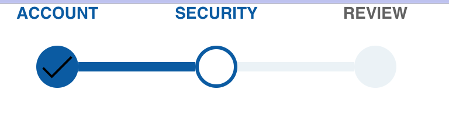

## Progress Step Bar Component
 
This is a React component that takes a `currentStep` and `allSteps`. It is styled to show the current step.

`<StepBar currentStep={this.state.currentStep} allSteps={this.state.allSteps} />`

```
this.state = {
      currentStep: null,
      allSteps: [
        { label: "account", isCompleted: true },
        { label: "security", isCompleted: true },
        { label: "review", isCompleted: true }
      ]
    }
```


Created on Sept 2019.

### Features
#### StepBar SubComponent

* includes a "label", "prebar", "statusCircle", "postbar"
* first bar of the first step is hidden, as well as the last bar of the last step


#### CSS styles for stepBar SubComponent: before current, is current, and after current styles

all stepbars are set as blue by default
```
.stepBar-statusIndicator-status {
    border-radius: 50%;
    width: 30px;
    height: 30px;
    border: 3px solid @blue;
    background-color: @blue;
}

```

the current one is light blue
```css
.stepBar-statusIndicator.stepBar-statusIndicator--current .stepBar-statusIndicator-bar--post,
.stepBar-statusIndicator.stepBar-statusIndicator--current + .stepBar-statusIndicator .stepBar-statusIndicator-bar {
    background-color: @light-blue;
}

```

stepbars after the current are light blue, and has a light blue border 
```css
.stepBar-statusIndicator.stepBar-statusIndicator--current + .stepBar-statusIndicator .stepBar-statusIndicator-status {
    background-color: @light-blue;
    border-color: @light-blue;
}
```

### Tech Stack
**Frontend:** React

**Backend:** CRA

**APIs:**
n/a

### To Run:
`yarn install`
`yarn start`

### Architecture
**index.js**
The entry point for component. Renders App component.

**app.js**
renders StepBar component. holds the main states `currentStep` and `allSteps`.

**StepBar.js**
renders the mapped step bars. 

### Improvements
- ? 
